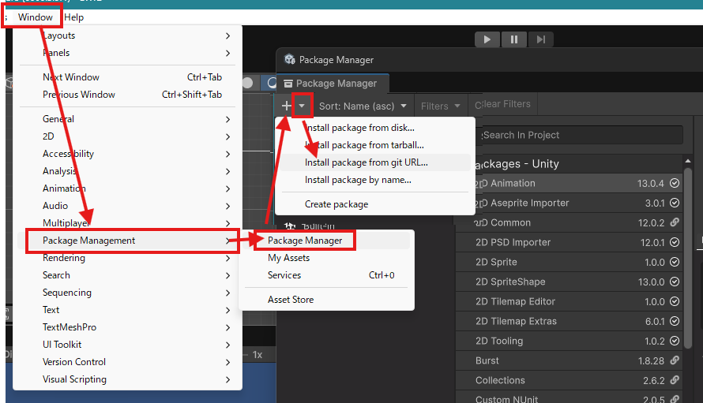
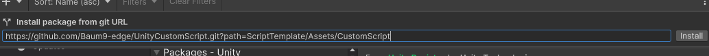
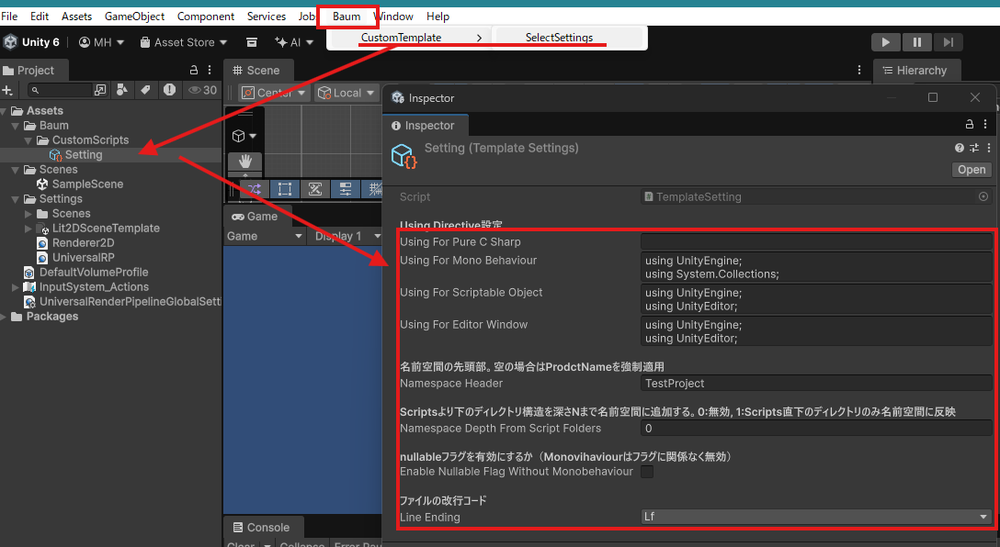
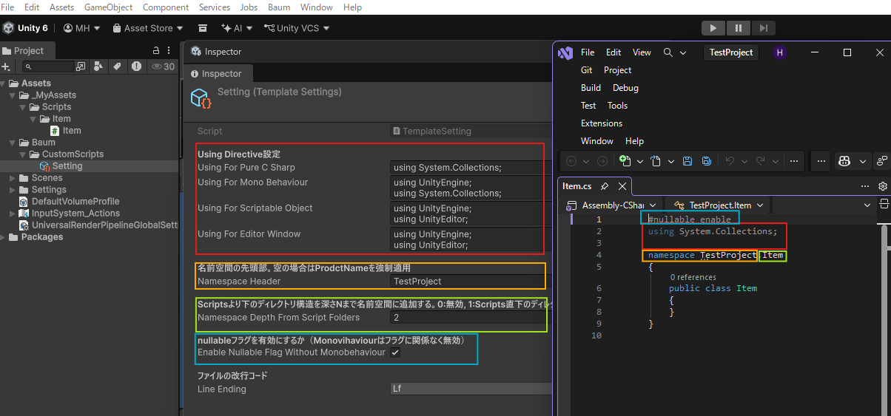
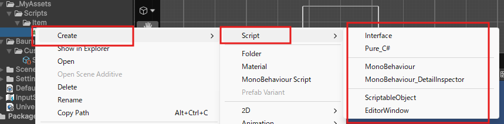

# Custom Template

UnityのScrptTemplateを用いたスクリプト生成の拡張機能をUPMとして提供します。

## 導入方法

PackageManagerより、Install packages from git URLを用いてパッケージをインストールしてください。

URL： `https://github.com/Baum9-edge/UnityCustomScript.git?path=ScriptTemplate/Assets/CustomScript`

## 利用方法

### 1. メニュー > Baum > Custom Template > SelectSettingsより設定ファイルを生成します。

設定を変更してください。

設定と実際に生成されるスクリプト例は下記のとおりです。

|枠色|効果|
|:--|:--|
|赤|記述したUsing句がスクリプトに展開されます|
|橙|名前空間の先頭文字列を指定します|
|緑|1以上の場合、Scripts以下のディレクトリ構造が名前空間に追加されます。 1の場合はScripts直下のディレクトリまでが名前空間に追加されます。 2の場合は孫ディレクトリまでが名前空間に追加されます。|
|青|有効な場合、InterfaceとPureC#のテンプレートの先頭にnullableフラグが追加されます。|

### 2. Projectウィンドウを右クリック > Script よりテンプレートを選択します。

選択後、通常のUnityEditorの生成と同じ流れでファイルが生成されます。

